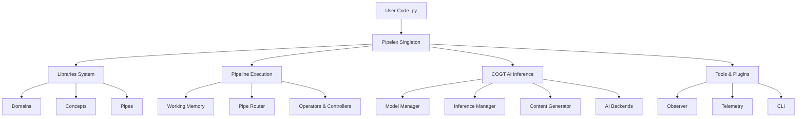
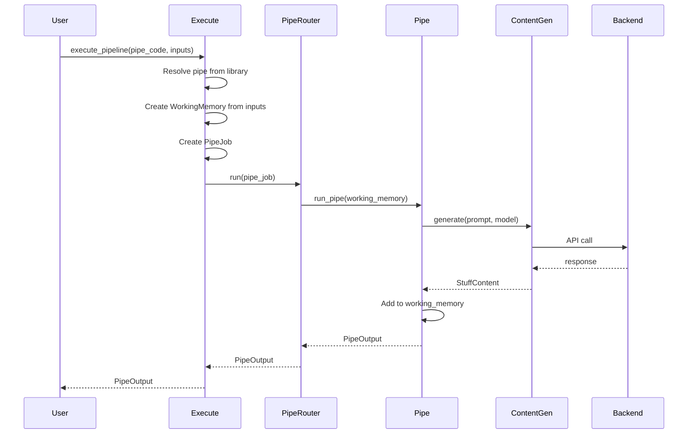
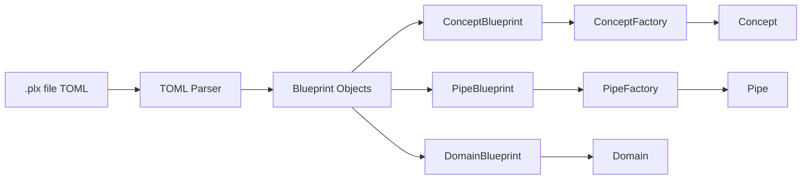

# Pipelex Codebase Architecture

This document provides a comprehensive explanation of Pipelex's internal architecture, code organization, and how all the components work together.

## Overview

**Pipelex** is an AI workflow orchestration framework that allows you to define declarative pipelines in `.plx` files (TOML format) to orchestrate AI operations like LLM calls, document extraction, image generation, and custom functions.

**Key Design Philosophy:**

- **Declarative over Imperative**: Define *what* you want, not *how* to do it
- **Type-safe**: Concepts provide semantic typing for all data
- **Composable**: Small pipes combine into complex workflows
- **Backend-agnostic**: Works with any AI provider (OpenAI, Anthropic, Ollama, etc.)
- **Observable**: Built-in tracking and telemetry

## High-Level Architecture



## Core Components

### 1. Pipelex Singleton - Central Orchestrator

**Location**: `pipelex/pipelex.py`

The `Pipelex` class is the main entry point and uses a singleton pattern (via `MetaSingleton`). It coordinates all subsystems.

#### Key Responsibilities

```python
class Pipelex(metaclass=MetaSingleton):
    def __init__(self, config_dir_path: str = "./pipelex"):
        # Initialize all managers
        self.plugin_manager = PluginManager()
        self.library_manager = LibraryManagerFactory.make(...)
        self.models_manager = ModelManager()
        self.pipeline_manager = PipelineManager()
        # ... and more
```

**Main Components Managed:**

- `plugin_manager`: Plugin system for inference backends
- `library_manager`: Loads domains, concepts, pipes from `.plx` files
- `models_manager`: Model configurations and routing
- `inference_manager`: Routes inference requests to backends
- `content_generator`: Content generation coordination
- `pipeline_manager`: Pipeline execution management
- `pipeline_tracker`: Tracking/logging pipeline runs
- `telemetry_manager`: Usage analytics (opt-in)
- `reporting_delegate`: Report generation

#### Lifecycle Methods

```python
# Setup
Pipelex.make(integration_mode=IntegrationMode.PYTHON)
    ↓
setup()           # Initialize all managers
    ↓
setup_libraries() # Load .plx files
    ↓
validate_libraries() # Validate concepts and pipes

# Teardown
teardown()        # Clean shutdown of all systems
```

#### Integration Modes

Pipelex adapts to different execution contexts:

- `PYTHON`: Direct Python integration
- `CLI`: Command-line interface
- `FASTAPI`: REST API service
- `DOCKER`: Containerized deployment
- `MCP`: Model Context Protocol
- `N8N`: n8n workflow integration
- `PYTEST`: Unit testing mode

---

### 2. Core System - Foundation (`pipelex/core/`)

The core system contains the fundamental building blocks.

#### A. Concepts - Semantic Types

**Location**: `pipelex/core/concepts/`

Concepts represent semantic entities in your domain (e.g., "Invoice", "Question", "Analysis").

```python
class Concept(BaseModel):
    code: str                    # PascalCase name (e.g., "Invoice")
    domain: str                  # Which domain it belongs to
    structure_class_name: str    # Python class for data structure
    refines: str | None          # Optional parent concept
    description: str
```

**How Concepts Work:**

1. **Native Concepts**: Built-in types
   ```python
   Text, Image, PDF, Number, Page, TextAndImages
   ```

2. **Inline Structure Definitions**: TOML-based
   ```toml
   [concept.Invoice.structure]
   invoice_number = "The unique invoice identifier"
   total_amount = { type = "number", description = "Total amount" }
   ```

3. **Python StructuredContent Classes**: For advanced features
   ```python
   class Invoice(StructuredContent):
       invoice_number: str
       total_amount: float = Field(ge=0)

       @field_validator('total_amount')
       def validate_tax(cls, v):
           # Custom validation logic
           return v
   ```

**Concept Compatibility:**

```python
# Concepts are compatible if:
- Same concept string
- One refines the other
- Same structure class
- Compatible fields
```

#### B. Stuffs - Runtime Data Containers

**Location**: `pipelex/core/stuffs/`

A `Stuff` wraps content with metadata at runtime.

```python
class Stuff(BaseModel):
    stuff_code: str              # Unique identifier
    stuff_name: str | None       # Variable name
    concept: Concept             # What concept it represents
    content: StuffContent        # The actual data
```

**Content Types** (all inherit from `StuffContent`):

```python
TextContent           # Plain text
ImageContent          # Image URLs/data
PDFContent            # PDF documents
NumberContent         # Numeric values
ListContent[T]        # Lists of content
TextAndImagesContent  # Mixed text + images
HtmlContent           # HTML output
MermaidContent        # Mermaid diagrams
StructuredContent     # Custom structured data (Pydantic)
```

**Example:**

```python
invoice_stuff = Stuff(
    stuff_code="inv_123",
    stuff_name="invoice",
    concept=Concept(code="Invoice", domain="finance", ...),
    content=InvoiceContent(
        invoice_number="INV-001",
        total_amount=1500.00
    )
)
```

#### C. Working Memory - Runtime State

**Location**: `pipelex/core/memory/working_memory.py`

The `WorkingMemory` is the runtime state container that holds all "stuffs" during pipeline execution.

```python
class WorkingMemory(BaseModel):
    root: dict[str, Stuff]      # Named stuffs
    aliases: dict[str, str]     # Aliases to stuffs

    # Access stuffs
    def get_stuff(self, name: str) -> Stuff
    def get_stuffs(self, names: set[str]) -> list[Stuff]

    # Main stuff (current output)
    def get_main_stuff(self) -> Stuff
    def set_new_main_stuff(self, stuff: Stuff)

    # Typed accessors
    def get_stuff_as_text(self, name: str) -> TextContent
    def get_stuff_as_image(self, name: str) -> ImageContent
    def main_stuff_as(self, content_type: Type[T]) -> T
```

**The "Main Stuff" Concept:**

- Working memory maintains a special "main_stuff" pointer
- This represents the "current output" of the pipeline
- Each pipe reads inputs from working memory and writes a new main_stuff
- Previous outputs remain accessible by name

**Example Flow:**

```python
working_memory = WorkingMemory()

# Add initial input
working_memory.add_new_stuff(
    name="document",
    stuff=Stuff(concept=PDF, content=PDFContent(...))
)

# After extraction pipe runs
working_memory.set_new_main_stuff(
    name="extracted_text",
    stuff=Stuff(concept=Text, content=TextContent(...))
)

# Access results
text = working_memory.get_main_stuff()
original_doc = working_memory.get_stuff("document")
```

#### D. Pipes - Executable Components

**Location**: `pipelex/core/pipes/`

Pipes are the executable components that transform data.

```python
class PipeAbstract(ABC, BaseModel):
    code: str                   # Unique pipe identifier
    domain: str                 # Which domain it belongs to
    inputs: InputRequirements   # Required input concepts
    output: Concept             # Output concept
    description: str | None

    @abstractmethod
    async def run_pipe(
        self,
        job_metadata: JobMetadata,
        working_memory: WorkingMemory,
        pipe_run_params: PipeRunParams,
        output_name: str | None = None,
    ) -> PipeOutput:
        pass
```

**Pipe Categories:**

1. **Operators** (do actual work):
   - `PipeLLM`: LLM inference (text/structured generation)
   - `PipeExtract`: Extract text from PDFs/images
   - `PipeImgGen`: Generate images
   - `PipeCompose`: Template-based text composition
   - `PipeFunc`: Execute custom Python functions

2. **Controllers** (control flow):
   - `PipeSequence`: Execute pipes in order
   - `PipeCondition`: Conditional branching
   - `PipeParallel`: Parallel execution
   - `PipeBatch`: Batch processing over lists

#### E. Domains & Bundles

**Location**: `pipelex/core/domains/`, `pipelex/core/bundles/`

**Domains**: Logical grouping of related concepts and pipes.

```toml
domain = "invoice_processing"
description = "Invoice analysis and extraction"
```

**Bundles**: Complete `.plx` files that contain:

- Domain declaration
- Concept definitions
- Pipe definitions

```toml
domain = "cv_match"

[concept.MatchAnalysis]
description = "CV-job match analysis"

[pipe.analyze_match]
type = "PipeLLM"
inputs = { cv = "Text", job = "Text" }
output = "MatchAnalysis"
```

---

### 3. Pipeline Execution System (`pipelex/pipeline/`)

#### A. Pipeline Execution Entry Point

**Location**: `pipelex/pipeline/execute.py`

```python
async def execute_pipeline(
    pipe_code: str,                          # Which pipe to run
    inputs: PipelineInputs | WorkingMemory,  # Input data
    pipe_run_mode: PipeRunMode = LIVE,       # LIVE or DRY
    dynamic_output_concept_code: str = None, # Override output type
) -> PipeOutput:
```

**Execution Flow:**



**PipeOutput:**

```python
class PipeOutput(BaseModel):
    working_memory: WorkingMemory
    pipeline_run_id: str

    # Convenience accessors
    @property
    def main_stuff_as_str(self) -> str

    def main_stuff_as(self, content_type: Type[T]) -> T
    def main_stuff_as_list(self, item_type: Type[T]) -> ListContent[T]
```

#### B. Pipe Routing

**Location**: `pipelex/pipe_run/pipe_router.py`

The `PipeRouter` routes pipe execution to appropriate handlers.

```python
class PipeRouter:
    async def run(self, pipe_job: PipeJob) -> PipeOutput:
        # Route to appropriate operator or controller
        # Handle batching, parallel execution, sequences
        # Manage pipe stack for recursion detection
        # Call observers for event tracking
```

**PipeJob:**

```python
class PipeJob(BaseModel):
    pipe: PipeAbstract              # Pipe to execute
    pipe_run_params: PipeRunParams  # Execution parameters
    job_metadata: JobMetadata       # Pipeline run info
    working_memory: WorkingMemory   # Runtime state
    output_name: str | None         # Where to write output
```

---

### 4. Pipe Operators (`pipelex/pipe_operators/`)

#### A. PipeLLM - LLM Inference

**Location**: `pipelex/pipe_operators/llm/`

Generate text or structured objects using LLMs.

```python
class PipeLLM(PipeOperator):
    prompt: str                    # User prompt template
    system_prompt: str | None      # System instructions
    model: LLMSettings            # Model config/preset
```

**Features:**

1. **Prompt Templating**:
   ```toml
   prompt = """
   Extract invoice info from:

   @invoice_text

   The category is: $category
   """
   ```
   - `@variable`: Block insertion (multi-line)
   - `$variable`: Inline insertion (short text)

2. **Structured Output**:
   ```toml
   output = "Invoice"  # Extracts to InvoiceContent Pydantic model
   ```

3. **Vision Support**:
   ```toml
   prompt = "Describe this image: $image"
   inputs = { image = "Image" }
   ```

4. **Multiple Outputs**:
   ```toml
   output = "Idea[3]"   # Generate exactly 3
   output = "Idea[]"    # Variable number
   ```

**Execution Flow:**

```
Prompt Template + Working Memory
    ↓
Resolve variables (@input, $value)
    ↓
Build full prompt with system instructions
    ↓
ContentGenerator.generate(prompt, model, output_schema)
    ↓
InferenceManager routes to backend
    ↓
Backend API call (OpenAI, Claude, etc.)
    ↓
Parse/validate response
    ↓
Return StuffContent
```

#### B. PipeExtract - Document Extraction

**Location**: `pipelex/pipe_operators/extract/`

Extract text and images from PDFs or images.

```python
class PipeExtract(PipeOperator):
    model: ExtractSettings | None  # Optional model config
```

**Output Structure:**

```python
class PageContent(StructuredContent):
    text_and_images: TextAndImagesContent  # Extracted content
    page_view: ImageContent | None         # Page screenshot
```

**Returns**: `ListContent[PageContent]` (one per page)

#### C. PipeImgGen - Image Generation

**Location**: `pipelex/pipe_operators/img_gen/`

Generate images using AI models.

```python
class PipeImgGen(PipeOperator):
    model: ImgGenSettings
    aspect_ratio: str | None      # "1:1", "16:9", etc.
    quality: str | None           # "standard" or "hd"
    seed: int | str | None        # For reproducibility
    output_format: str | None     # "png", "jpeg", "webp"
```

#### D. PipeCompose - Template Composition

**Location**: `pipelex/pipe_operators/compose/`

Template-based text composition using Jinja2.

```python
class PipeCompose(PipeOperator):
    template: str                  # Jinja2 template
    template_category: str         # "html", "markdown", etc.
```

**Example:**

```toml
template = """
## Report Summary

Data: $data

Generated: {{ current_date }}
"""
```

#### E. PipeFunc - Custom Functions

**Location**: `pipelex/pipe_operators/func/`

Execute custom Python functions.

```python
class PipeFunc(PipeOperator):
    function_name: str  # Registered function name
```

**Function Requirements:**

```python
@func_registry.register("my_function")
async def my_function(working_memory: WorkingMemory) -> StuffContent:
    input_data = working_memory.get_stuff("input_name")
    # Custom logic
    result = process(input_data.content)
    return ResultContent(data=result)
```

---

### 5. Pipe Controllers (`pipelex/pipe_controllers/`)

#### A. PipeSequence - Sequential Execution

**Location**: `pipelex/pipe_controllers/sequence/`

Execute pipes in order, passing outputs to next steps.

```toml
[pipe.process_document]
type = "PipeSequence"
inputs = { document = "PDF" }
output = "Analysis"
steps = [
    { pipe = "extract_text", result = "text" },
    { pipe = "analyze_text", result = "analysis" }
]
```

**Step Execution:**

1. Each step runs a pipe
2. Output is stored in working memory with `result` name
3. Next steps can reference previous results
4. Final step's output becomes main_stuff

**Batching in Steps:**

```toml
{ pipe = "process_item", batch_over = "items", batch_as = "item", result = "processed" }
```

- `batch_over`: ListContent to iterate over
- `batch_as`: Name for current item
- Processes items in parallel

#### B. PipeCondition - Conditional Branching

**Location**: `pipelex/pipe_controllers/condition/`

Choose which pipe to execute based on expressions.

```toml
[pipe.conditional]
type = "PipeCondition"
expression = "data.category"
default_outcome = "default_pipe"

[pipe.conditional.outcomes]
small = "process_small"
large = "process_large"
```

**Expression Evaluation:**

- `expression`: Direct field access (`data.category`)
- `expression_template`: Jinja2 template (`{{ data.size > 100 }}`)
- Result maps to outcome pipe via `outcomes` dict
- `default_outcome`: Fallback (use `"fail"` to error on no match)

#### C. PipeParallel - Parallel Execution

**Location**: `pipelex/pipe_controllers/parallel/`

Execute multiple pipes concurrently.

```toml
[pipe.parallel_processing]
type = "PipeParallel"
pipes = ["pipe_a", "pipe_b", "pipe_c"]
```

Results collected into a list.

#### D. PipeBatch - Batch Processing

**Location**: `pipelex/pipe_controllers/batch/`

Process list items in parallel with a pipe.

```toml
[pipe.batch_process]
type = "PipeBatch"
batch_over = "input_list"
batch_as = "current_item"
pipe = "process_single_item"
```

---

### 6. COGT - Content Generation & Inference (`pipelex/cogt/`)

**COGT** = Content Generation Technology (the AI inference layer)

#### A. Model Management

**Location**: `pipelex/cogt/models/model_manager.py`

The `ModelManager` handles all model configuration.

```python
class ModelManager:
    def setup(self):
        # Load configurations from .pipelex/inference/
        self.load_backends()
        self.load_model_deck()
        self.load_routing_profiles()
```

**Configuration Files:**

```
.pipelex/inference/
├── backends.toml              # Backend configs
├── backends/
│   ├── openai.toml
│   ├── anthropic.toml
│   └── ollama.toml
├── deck/
│   ├── base_deck.toml        # LLM aliases and presets
│   └── overrides.toml        # User overrides
└── routing_profiles.toml     # Model routing rules
```

**Model Deck (`base_deck.toml`):**

```toml
[aliases]
base-claude = "claude-4.5-sonnet"
base-gpt = "gpt-5"
base-gemini = "gemini-2.5-flash"

[llm_presets]
llm_for_complex_reasoning = { model = "base-claude", temperature = 1 }
llm_to_extract_invoice = { model = "gpt-5", temperature = 0.1 }
```

#### B. Inference Backends

**Location**: `pipelex/cogt/model_backends/`

Each backend implements the `InferenceBackendProtocol`:

```python
class InferenceBackendProtocol(Protocol):
    async def send_llm_request(
        self,
        messages: list[Message],
        model: str,
        response_format: dict | None,
        **kwargs
    ) -> LLMResponse:
        pass
```

**Supported Backends:**

- `pipelex_inference`: Pipelex managed API
- `openai`: OpenAI API (GPT models)
- `anthropic`: Anthropic API (Claude models)
- `google`: Google AI (Gemini models)
- `mistral`: Mistral AI
- `ollama`: Local Ollama models (100% local)
- `internal`: No-op backend for testing

**Backend Configuration:**

```toml
[openai]
enabled = true
endpoint = "https://api.openai.com/v1"
api_key_env_var = "OPENAI_API_KEY"

[ollama]
enabled = true
endpoint = "http://localhost:11434/v1"
# No API key needed for local Ollama
```

#### C. Content Generator

**Location**: `pipelex/cogt/content_generation/content_generator.py`

Coordinates LLM calls and response processing.

```python
class ContentGenerator:
    async def generate(
        self,
        prompt: str,
        model_settings: LLMSettings,
        output_concept: Concept,
        system_prompt: str | None = None,
    ) -> StuffContent:
        # Build messages
        # Add images if vision model
        # Route to backend
        # Parse structured output
        # Validate against Pydantic model
        # Return StuffContent
```

**Flow:**

```
Prompt + Model + Output Schema
    ↓
Build Messages (system + user)
    ↓
Add Vision Content (if images)
    ↓
InferenceManager.send_request(messages, model)
    ↓
Backend API Call
    ↓
Parse Response (JSON for structured output)
    ↓
Validate with Pydantic
    ↓
Return StuffContent
```

#### D. Inference Manager

**Location**: `pipelex/cogt/inference/inference_manager.py`

Routes inference requests to appropriate backends.

```python
class InferenceManager:
    def route_model(self, model: str) -> InferenceBackend:
        # Determine which backend handles this model
        # Check routing profiles
        # Return backend instance
```

---

### 7. Language Parser (`pipelex/language/`)

**Purpose**: Parse `.plx` files (TOML) into Python objects.

**Flow:**



**Blueprint → Factory → Runtime Pattern:**

1. **Blueprint**: Intermediate representation from TOML
2. **Factory**: Creates validated runtime objects
3. **Runtime**: Executable Concept/Pipe instances

**Validation** (`pipeline/validate_plx.py`):

- **Static validation**: Syntax, types, required fields
- **Dynamic validation**: Concept compatibility, pipe dependencies
- **Circular dependency detection**: Prevents infinite recursion

---

### 8. Builder - AI-Assisted Pipeline Generation (`pipelex/builder/`)

**Purpose**: Generate `.plx` files from natural language.

```bash
pipelex build pipe "Extract invoice data from PDFs" --output invoice.plx
```

**Flow:**

```
User Description
    ↓
Builder LLM (analyzes requirements)
    ↓
Generate TOML (.plx file)
    ↓
Validate generated pipeline
    ↓
If errors: Fix with LLM iteratively
    ↓
Write to file
```

**Builder Architecture:**

- `builder/pipe/`: Pipe generation
- `builder/concept/`: Concept generation
- Uses LLMs to understand requirements
- Validates and refines output
- Follows Pipelex best practices

---

### 9. CLI (`pipelex/cli/`)

**Location**: `pipelex/cli/commands/`

**Commands:**

```bash
pipelex init              # Initialize project
pipelex validate FILE     # Validate pipelines
pipelex run PIPE          # Execute pipeline
pipelex show pipes        # List all pipes
pipelex show models       # List available models
pipelex build pipe DESC   # Generate pipeline with AI
pipelex config            # Manage configuration
```

**Command Structure:**

Each command is a Python module with:
- Argument parsing (using Click/Typer)
- Command logic
- Output formatting

---

### 10. Libraries (`pipelex/libraries/`)

**LibraryManager** discovers and loads `.plx` files.

```python
class LibraryManager:
    domain_library: DomainLibrary
    concept_library: ConceptLibrary
    pipe_library: PipeLibrary

    def setup(self):
        # Discover .plx files

    def load_libraries(self):
        # Parse and register all definitions

    def validate_libraries(self):
        # Validate all pipes and concepts
```

**Discovery Process:**

1. Scan project directory for `.plx` files
2. Parse TOML into blueprints
3. Create runtime objects (Concept, Pipe)
4. Register in libraries
5. Validate cross-references

**Hot-Reloading:**

During development, the library manager can reload `.plx` files without restarting.

---

### 11. Observer & Telemetry

#### A. Observer Pattern (`pipelex/observer/`)

Track pipeline events:

```python
class ObserverProtocol(Protocol):
    async def on_pipeline_start(self, event: PipelineStartEvent)
    async def on_pipeline_complete(self, event: PipelineCompleteEvent)
    async def on_pipe_run(self, event: PipeRunEvent)
    async def on_error(self, event: ErrorEvent)
```

**Built-in Observers:**

- `LocalObserver`: Local logging
- `ObserverTelemetry`: Usage analytics (opt-in)

**MultiObserver:**

Combines multiple observers to track events in parallel.

#### B. Telemetry (`pipelex/system/telemetry/`)

**Opt-in usage analytics:**

```toml
# .pipelex/telemetry.toml
enabled = true
respect_dnt = true  # Respect DO_NOT_TRACK env var
```

**Events Tracked:**

- Pipeline executions
- Pipe runs
- Model inference calls
- Errors and warnings

**Privacy:**

- No code or data sent
- Only metadata (pipe types, model names, durations)
- Fully disable with `DO_NOT_TRACK=1`

---

### 12. Plugins (`pipelex/plugins/`)

**Plugin System** for AI providers:

Each provider is a plugin with:
- Backend implementation
- Model configurations
- Optional dependencies

**Available Plugins:**

- `anthropic/`: Claude integration
- `openai/`: OpenAI integration
- `google/`: Gemini integration
- `mistral/`: Mistral integration
- `bedrock/`: AWS Bedrock
- `fal/`: Fal.ai image generation
- `pypdfium2/`: PDF processing

**Plugin Loading:**

```python
class PluginManager:
    def setup(self):
        # Discover installed plugins
        # Load only if dependencies available
        # Register backends
```

---

### 13. System Registry (`pipelex/system/registries/`)

#### A. Class Registry

**Location**: `pipelex/system/registries/` (uses `kajson` library)

Dynamic class loading for `StuffContent` classes:

```python
class_registry.register_class(InvoiceContent)
class_registry.get_class("InvoiceContent") -> type[InvoiceContent]
```

#### B. Function Registry

**Location**: `pipelex/system/registries/func_registry.py`

Register functions for `PipeFunc`:

```python
@func_registry.register("my_function")
async def my_function(working_memory: WorkingMemory) -> StuffContent:
    # Custom logic
    pass
```

---

## Design Patterns

### 1. Blueprint → Factory → Runtime

Used throughout for separation of concerns:

```python
# Blueprint (from TOML)
ConceptBlueprint → ConceptFactory → Concept
PipeBlueprint → PipeFactory → PipeAbstract

# Allows validation before instantiation
# Enables different factories for testing
```

### 2. Singleton Pattern

```python
class Pipelex(metaclass=MetaSingleton):
    # Ensures single instance
    # Provides global access via get_instance()
```

### 3. Protocol/Interface Pattern

Define contracts without implementation:

```python
class ContentGeneratorProtocol(Protocol):
    async def generate(...) -> StuffContent: ...

class InferenceBackendProtocol(Protocol):
    async def send_llm_request(...) -> LLMResponse: ...
```

### 4. Registry Pattern

Manage collections of objects by name:

```python
# Concept/Pipe/Domain libraries
concept_library.get_concept("Invoice") -> Concept

# Function registry
func_registry.get_function("my_func") -> callable

# Class registry
class_registry.get_class("InvoiceContent") -> type
```

### 5. Dependency Injection

`Pipelex.make()` accepts all major components as parameters:

```python
Pipelex.make(
    secrets_provider=CustomSecretsProvider(),
    models_manager=CustomModelManager(),
    # ... customize any component
)
```

### 6. Observer Pattern

Event-driven architecture for tracking:

```python
multi_observer.on_pipeline_start(event)
# Notifies all registered observers
```

---

## Complete Data Flow Example

Let's trace a complete execution from user code to API response:

```python
# User code
from pipelex.pipelex import Pipelex
from pipelex.pipeline.execute import execute_pipeline
from pipelex.core.stuffs.pdf_content import PDFContent

Pipelex.make()

result = await execute_pipeline(
    pipe_code="analyze_invoice",
    inputs={"invoice_pdf": PDFContent(url="invoice.pdf")}
)

print(result.main_stuff_as_str)
```

### Step-by-Step Internal Flow

#### 1. Initialization (`Pipelex.make()`)

```python
# pipelex/pipelex.py
Pipelex.make()
    ↓
__init__()
    ↓
setup()
    - Load config from .pipelex/
    - Setup model backends
    - Initialize managers
    ↓
setup_libraries()
    - Discover .plx files
    - Parse TOML → Blueprints
    - Create Concept/Pipe objects
    - Register in libraries
    ↓
validate_libraries()
    - Validate all pipes
    - Check concept compatibility
```

#### 2. Pipeline Start (`execute_pipeline()`)

```python
# pipelex/pipeline/execute.py
execute_pipeline(pipe_code="analyze_invoice", inputs={...})
    ↓
# Resolve pipe from library
pipe = get_required_pipe("analyze_invoice")
    ↓
# Create working memory
working_memory = WorkingMemoryFactory.make_from_pipeline_inputs(inputs)
# → Converts PDFContent input to Stuff and adds to memory
    ↓
# Create pipeline and job
pipeline = pipeline_manager.add_new_pipeline()
pipe_job = PipeJobFactory.make_pipe_job(pipe, working_memory, ...)
```

#### 3. Pipe Execution

Assume "analyze_invoice" is a `PipeSequence`:

```toml
[pipe.analyze_invoice]
type = "PipeSequence"
steps = [
    { pipe = "extract_text", result = "text" },
    { pipe = "parse_invoice", result = "invoice" }
]
```

**Sequence Execution:**

```python
# pipelex/pipe_controllers/sequence/pipe_sequence.py
PipeSequence.run_pipe(working_memory)
    ↓
for step in steps:
    # Step 1: extract_text
    result = await pipe_router.run(
        PipeJob(pipe="extract_text", working_memory)
    )
    working_memory.add_new_stuff(name="text", stuff=result.main_stuff)
```

#### 4. Step 1: Extract Text (`PipeExtract`)

```python
# pipelex/pipe_operators/extract/pipe_extract.py
PipeExtract.run_pipe(working_memory)
    ↓
# Get PDF from working memory
pdf_stuff = working_memory.get_stuff("invoice_pdf")
pdf_content = pdf_stuff.as_pdf
    ↓
# Call extraction backend (vision model or OCR)
extracted_pages = await extract_content(pdf_content)
# → Returns ListContent[PageContent]
    ↓
# Add to working memory
working_memory.set_new_main_stuff(
    name="text",
    stuff=Stuff(concept=Page, content=extracted_pages)
)
```

#### 5. Step 2: Parse Invoice (`PipeLLM`)

```python
# pipelex/pipe_operators/llm/pipe_llm.py
PipeLLM.run_pipe(working_memory)
    ↓
# Get text from working memory
text_stuff = working_memory.get_stuff("text")
    ↓
# Build prompt from template
prompt = render_template(self.prompt, working_memory)
# Template: "Extract invoice data from: @text"
# → Replaces @text with extracted text content
    ↓
# Generate content
result = await content_generator.generate(
    prompt=prompt,
    model_settings=self.model,
    output_concept=self.output,  # "Invoice"
    system_prompt=self.system_prompt
)
```

#### 6. Content Generation

```python
# pipelex/cogt/content_generation/content_generator.py
ContentGenerator.generate(prompt, model, output_concept)
    ↓
# Resolve model
model_name = model_manager.resolve_model(model_settings.model)
# e.g., "gpt-5" from preset
    ↓
# Build messages
messages = [
    {"role": "system", "content": system_prompt},
    {"role": "user", "content": prompt}
]
    ↓
# Get output schema for structured output
output_schema = concept.get_pydantic_schema()
# → JSON schema for InvoiceContent
    ↓
# Route to backend
backend = inference_manager.get_backend_for_model(model_name)
response = await backend.send_llm_request(
    messages=messages,
    model=model_name,
    response_format=output_schema
)
```

#### 7. Backend API Call

```python
# pipelex/plugins/openai/openai_backend.py
OpenAIBackend.send_llm_request(messages, model, response_format)
    ↓
# Get API key
api_key = secrets_provider.get_secret("OPENAI_API_KEY")
    ↓
# Make API call
async with httpx.AsyncClient() as client:
    response = await client.post(
        url="https://api.openai.com/v1/chat/completions",
        headers={"Authorization": f"Bearer {api_key}"},
        json={
            "model": model,
            "messages": messages,
            "response_format": {"type": "json_object", "schema": response_format}
        }
    )
    ↓
# Parse response
llm_response = LLMResponse(
    content=response.json()["choices"][0]["message"]["content"],
    model=model,
    usage=response.json()["usage"]
)
```

#### 8. Response Processing

```python
# Back in content_generator.py
# Parse JSON response
json_data = json.loads(llm_response.content)
    ↓
# Validate against Pydantic model
InvoiceContent_class = class_registry.get_class("InvoiceContent")
invoice_content = InvoiceContent_class.model_validate(json_data)
# → Validates: invoice_number, total_amount, etc.
    ↓
# Return StuffContent
return invoice_content
```

#### 9. Add to Working Memory

```python
# Back in pipe_llm.py
# Create Stuff
invoice_stuff = Stuff(
    stuff_code=generate_code(),
    stuff_name="invoice",
    concept=self.output,  # Invoice concept
    content=invoice_content
)
    ↓
# Add to working memory as main_stuff
working_memory.set_new_main_stuff(name="invoice", stuff=invoice_stuff)
    ↓
# Return PipeOutput
return PipeOutput(
    working_memory=working_memory,
    pipeline_run_id=pipeline.pipeline_run_id
)
```

#### 10. Return to User

```python
# Back in user code
result = await execute_pipeline(...)
# → result.working_memory contains:
#   - "invoice_pdf": Original PDF
#   - "text": Extracted text (ListContent[Page])
#   - "invoice": Parsed invoice (InvoiceContent) ← main_stuff
    ↓
# User extracts result
invoice = result.main_stuff_as(InvoiceContent)
print(f"Invoice #{invoice.invoice_number}: ${invoice.total_amount}")
```

---

## Key Architectural Principles

### 1. Declarative over Imperative

Users define **what** they want, not **how** to do it:

```toml
# Declarative: Define the transformation
[pipe.extract_and_analyze]
type = "PipeSequence"
steps = [
    { pipe = "extract", result = "text" },
    { pipe = "analyze", result = "analysis" }
]

# No imperative code needed!
```

### 2. Type Safety via Concepts

Every piece of data has a semantic type (Concept):

```python
# Type-safe transformations
PDF → (PipeExtract) → Text → (PipeLLM) → Invoice

# Validation at compile-time (pipeline validation)
# Not runtime errors
```

### 3. Separation of Concerns

Clear boundaries between layers:

- **Language layer**: Parse `.plx` files
- **Core layer**: Concepts, Pipes, Stuffs
- **Execution layer**: Pipeline execution, routing
- **Inference layer**: AI model calls
- **Tools layer**: CLI, logging, storage

### 4. Extensibility

Every major component can be customized:

```python
# Custom secrets provider
class VaultSecretsProvider(SecretsProviderAbstract):
    def get_secret(self, key: str) -> str:
        return vault_client.read(key)

Pipelex.make(secrets_provider=VaultSecretsProvider())
```

### 5. Backend Agnostic

Works with any AI provider:

```toml
# Switch providers easily
model = { model = "gpt-5", temperature = 0.7 }
# or
model = { model = "claude-4.5-sonnet", temperature = 0.7 }
# or
model = { model = "llama3", temperature = 0.7 }  # Local Ollama
```

### 6. Testability

- Dry-run mode (no API calls)
- Dependency injection for all components
- Protocol-based interfaces
- Pytest integration mode

---

## Directory Structure Summary

```
pipelex/
├── pipelex.py                 # Main Pipelex singleton
├── core/                      # Core abstractions
│   ├── concepts/              # Concept system
│   ├── domains/               # Domain grouping
│   ├── pipes/                 # Pipe abstractions
│   ├── stuffs/                # Runtime data containers
│   ├── memory/                # Working memory
│   └── bundles/               # .plx file bundles
├── pipeline/                  # Pipeline execution
│   ├── execute.py             # Main entry point
│   ├── pipeline_manager.py   # Pipeline lifecycle
│   └── validate_plx.py        # Pipeline validation
├── pipe_operators/            # Actual work pipes
│   ├── llm/                   # LLM inference
│   ├── extract/               # Document extraction
│   ├── img_gen/               # Image generation
│   ├── compose/               # Template composition
│   └── func/                  # Custom functions
├── pipe_controllers/          # Flow control pipes
│   ├── sequence/              # Sequential execution
│   ├── condition/             # Conditional branching
│   ├── parallel/              # Parallel execution
│   └── batch/                 # Batch processing
├── pipe_run/                  # Execution runtime
│   ├── pipe_router.py         # Route to handlers
│   └── pipe_job.py            # Job definition
├── cogt/                      # AI inference layer
│   ├── models/                # Model management
│   ├── inference/             # Inference routing
│   ├── model_backends/        # Backend implementations
│   └── content_generation/    # Content generation
├── language/                  # .plx parser
├── builder/                   # AI-assisted generation
├── libraries/                 # Library discovery/loading
├── cli/                       # Command-line interface
├── observer/                  # Event tracking
├── plugins/                   # Provider plugins
├── system/                    # System utilities
│   ├── registries/            # Class/function registries
│   ├── telemetry/             # Usage analytics
│   └── configuration/         # Config management
└── tools/                     # Utilities
    ├── log/                   # Logging
    ├── secrets/               # Secrets management
    ├── storage/               # Storage abstraction
    └── misc/                  # Various utils
```

---

## Conclusion

Pipelex is a well-architected system with clear separation of concerns:

1. **Declarative Language**: `.plx` files define workflows
2. **Core Abstractions**: Concepts, Pipes, Stuffs, Working Memory
3. **Execution Engine**: Pipeline execution, routing, operators
4. **AI Layer**: Model management, inference routing, content generation
5. **Extensibility**: Plugins, dependency injection, protocols

The architecture follows modern software engineering principles:
- Single responsibility
- Dependency injection
- Protocol-based interfaces
- Separation of concerns
- Testability

This makes Pipelex both powerful for users (declarative workflows) and maintainable for developers (clean architecture).
