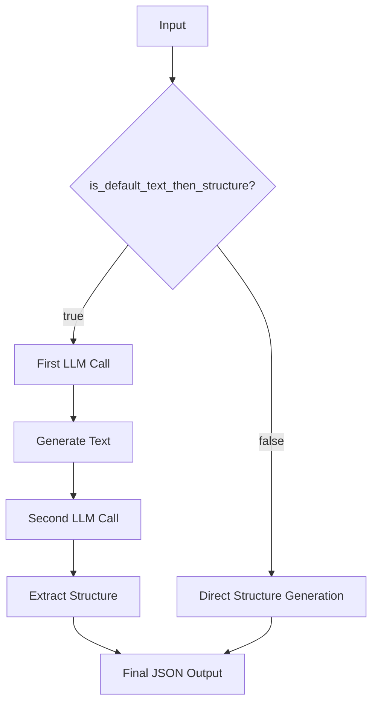

# Structure Configuration

The `StructureConfig` class controls how Pipelex handles structural processing of content, particularly in LLM-based pipes.

## Configuration Options

```python
class StructureConfig(ConfigModel):
    is_default_text_then_structure: bool
```

### Fields

- `is_default_text_then_structure`: When true, uses a two-step LLM process where text is generated first, then structured into a JSON object

## Example Configuration

```toml
[pipelex.structure_config]
is_default_text_then_structure = false  # Set to true for better results: generates text before structuring
```

## Processing Flow

The `is_default_text_then_structure` flag determines how LLM pipes generate structured content:

### Two-Step Process (When `true`)

1. **First LLM Call**: Generates preliminary text
    - Uses the pipe's main prompt template
    - Produces natural language text about the subject

2. **Second LLM Call**: Converts text to structure
    - Uses a specialized system prompt: "You are a data modeling expert specialized in extracting structure from text"
    - Uses a template that instructs the LLM to extract structured data:
   ```
   Your job is to extract and structure information from a text.
   Here is the text:
   {{ preliminary_text|tag("text") }}

   Now generate the JSON in the required format.
   Do not create information that is not in the text.
   ```
    - Produces a JSON object matching the required concept structure

### Single-Step Process (When `false`)

- Single LLM call that directly generates the structured output
- Uses the pipe's main prompt template
- Produces structured JSON directly

## Use Cases

### When to Use Two-Step Process (`true`)

- When you want more natural and fluid content generation
- When the structure is complex and needs careful extraction
- When you want to ensure all generated content is properly structured
- When you need better control over the extraction process
- When you want to debug or inspect the intermediate text

### When to Use Single-Step Process (`false`)

- When the structure is simple and straightforward
- When you need faster processing (avoids second LLM call)
- When the output format is well-defined and easy to generate
- When you want to reduce API costs
- When the prompt is already optimized for structured output

## Technical Details

The two-step process uses:

1. The pipe's configured prompts for initial text generation
2. A specialized structure extraction prompt that can be customized:
   - Through domain configuration (`domain.prompt_template_to_structure`)
   - Through pipe configuration (`pipe.prompt_template_to_structure`)
   - Falls back to base template if not specified

## Example Flow


