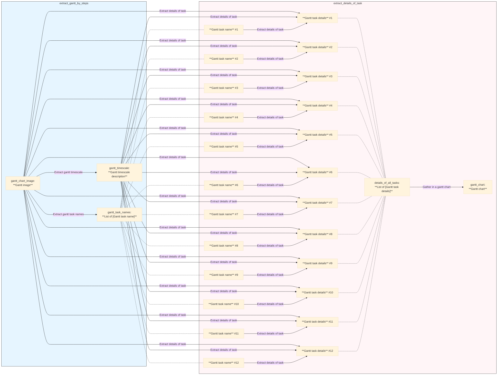

# Example: Gantt Chart Extraction

This example showcases the ability of Pipelex to extract structured information from images. In this case, it processes an image of a Gantt chart and extracts the tasks, dates, and dependencies.

## Get the code

[**➡️ View on GitHub: examples/extract_gantt.py**](https://github.com/Pipelex/pipelex-cookbook/blob/main/examples/extract_gantt.py)

## The Pipeline Explained

The pipeline takes an image as input, creates a working memory, and then executes the `extract_gantt_by_steps` pipeline to produce a structured `GanttChart` object.

```python
async def extract_gantt(image_url: str) -> GanttChart:
    # Create Working Memory
    working_memory = WorkingMemoryFactory.make_from_image(
        image_url=image_url,
        concept_string="gantt.GanttImage",
        name="gantt_chart_image",
    )

    # Run the pipe
    pipe_output = await execute_pipeline(
        pipe_code="extract_gantt_by_steps",
        working_memory=working_memory,
    )

    # Output the result
    return pipe_output.main_stuff_as(content_type=GanttChart)
```

This is a powerful demonstration of multi-modal capabilities, combining vision and language understanding.

## The Data Structure: `GanttChart` Model

The final output is a `GanttChart` object, which contains lists of tasks and milestones. These are themselves structured objects, ensuring the data is clean and easy to work with.

```python
class GanttTaskDetails(StructuredContent):
    """Do not include timezone in the dates."""
    name: str
    start_date: Optional[datetime] = None
    end_date: Optional[datetime] = None
    # ...

class Milestone(StructuredContent):
    name: str
    date: Optional[datetime]
    # ...

class GanttChart(StructuredContent):
    tasks: Optional[List[GanttTaskDetails]]
    milestones: Optional[List[Milestone]]
```

## The Pipeline Definition: `gantt.plx`

The `extract_gantt_by_steps` pipeline is a sequence of smaller, focused pipes. This is a great example of building a complex workflow from simple, reusable components.

```plx
[pipe.extract_gantt_by_steps]
type = "PipeSequence"
description = "Extract all details from a gantt chart"
inputs = { gantt_chart_image = "GanttChartImage" }
output = "GanttChart"
steps = [
    # First, figure out the timescale of the chart
    { pipe = "extract_gantt_timescale", result = "gantt_timescale" },
    # Then, get the names of all the tasks
    { pipe = "extract_gantt_task_names", result = "gantt_task_names" },
    # Then, for each task, extract the details
    { pipe = "extract_details_of_task", batch_as = "gantt_task_name", result = "details_of_all_tasks" },
    # Finally, assemble everything into a single GanttChart object
    { pipe = "gather_in_a_gantt_chart", result = "gantt_chart" },
]

# This is the pipe that extracts the details for a single task
[pipe.extract_details_of_task]
type = "PipeLLM"
description = "Extract the precise dates of the task, start_date and end_date"
inputs = { gantt_chart_image = "GanttChartImage", gantt_timescale = "GanttTimescaleDescription", gantt_task_name = "GanttTaskName" }
output = "GanttTaskDetails" # The output is structured as a GanttTaskDetails object
structuring_method = "preliminary_text"
llm = "llm_to_extract_diagram"
prompt_template = """
I am sharing an image of a Gantt chart.
Please analyse the image and for a given task name (and only this task), extract the information of the task, if relevant.

Be careful, the time unit is this:
@gantt_timescale

If the task is a milestone, then only output the start_date.

Here is the name of the task you have to extract the dates for:
@gantt_task_name
"""
```
This demonstrates the "divide and conquer" approach that Pipelex encourages. By breaking down a complex problem into smaller steps, each step can be handled by a specialized pipe, making the overall workflow more robust and easier to debug. 

## Flowchart

