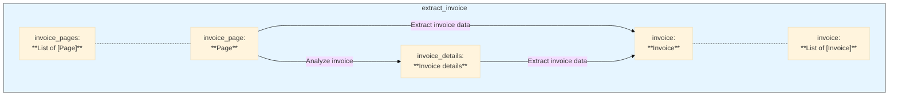

# Example: Invoice Extractor

This example provides a comprehensive pipeline for processing invoices. It takes a PDF invoice, extracts key information, and returns a structured `Invoice` object. It also demonstrates how to generate reports and track pipeline execution.

## Get the code

[**➡️ View on GitHub: examples/invoice_extractor.py**](https://github.com/Pipelex/pipelex-cookbook/blob/main/examples/invoice_extractor.py)

## The Pipeline Explained

The `process_invoice` pipeline is a complete workflow for invoice processing.

```python
async def process_expense_report() -> ListContent[Invoice]:
    invoice_pdf_path = "assets/invoice_extractor/invoice_1.pdf"

    # Create Stuff objects
    working_memory = WorkingMemoryFactory.make_from_pdf(
        pdf_url=invoice_pdf_path,
        name="invoice_pdf",
    )
    pipe_output = await execute_pipeline(
        pipe_code="process_invoice",
        working_memory=working_memory,
    )

    return pipe_output.main_stuff_as_list(item_type=Invoice)
```

This example also showcases some of the powerful observability features of Pipelex. After the pipeline runs, it generates a cost report and a flowchart of the execution.

```python
# Print the cost reporting
get_report_delegate().generate_report()

# Print the flowchart url of the pipeline.
get_pipeline_tracker().output_flowchart()
```
This is invaluable for understanding the cost and the execution flow of your pipelines.

## The Data Structure: `Invoice` Model

The pipeline's output is a structured `Invoice` object. This is defined using Pydantic's `BaseModel`, which allows for clear, typed, and validated data.

```python
class Invoice(StructuredContent):
    """Invoice information extracted from text, supporting both formal bills and receipts"""

    invoice_id: Optional[str] = Field(None, description="Unique identifier for the invoice")
    invoice_number: Optional[str] = Field(None, description="Invoice number as shown on the document")
    date: Optional[datetime] = Field(None, description="Date when the invoice was issued")
    
    amount_incl_tax: Optional[float] = Field(None, description="Total amount including taxes")
    
    vendor: Optional[str] = Field(None, description="Name of the vendor/seller")
    
    # ... other fields
```

## The Pipeline Definition: `invoice.plx`

The entire workflow is defined in a PLX file. This declarative approach makes the pipeline easy to understand and modify. Here's a snippet from `invoice.plx`:

```plx
# The main pipeline, a sequence of steps
[pipe.process_invoice]
type = "PipeSequence"
definition = "Process relevant information from an invoice"
inputs = { invoice_pdf = "PDF" }
output = "Invoice"
steps = [
    # First, run OCR on the PDF
    { pipe = "extract_text_from_image", result = "invoice_pages" },
    # Then, run the invoice extraction on each page
    { pipe = "extract_invoice", batch_over = "invoice_pages", batch_as = "invoice_page", result = "invoice" },
]

# A sub-pipeline that uses an LLM to extract the data
[pipe.extract_invoice_data]
type = "PipeLLM"
definition = "Extract invoice information from an invoice text transcript"
inputs = { "invoice_page.page_view" = "Page", invoice_details = "InvoiceDetails" }
output = "Invoice"
# The output is constrained to the "Invoice" model
llm = "llm_to_extract_invoice" 
prompt_template = """
Extract invoice information from this invoice:

The category of this invoice is: $invoice_details.category.

@invoice_page.text_and_images.text.text
"""
```
This shows how a complex workflow, including OCR and LLM calls, can be defined in a simple, readable format. The `llm = "llm_to_extract_invoice"` line is particularly powerful, as it tells the LLM to structure its output according to the `Invoice` model. 

## The Pipeline Flowchart

