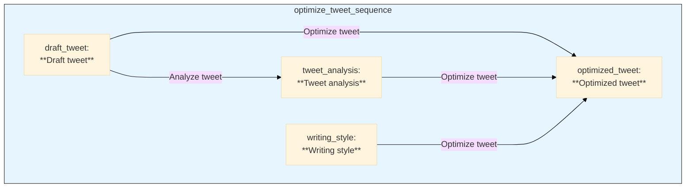

# Example: Tweet Optimizer

This example demonstrates how to create a pipeline that takes a draft of a tweet and a desired writing style, and then generates an optimized tweet. This is a practical example of "style transfer" for text.

## Get the code

[**➡️ View on GitHub: examples/wip/write_tweet.py**](https://github.com/Pipelex/pipelex-cookbook/blob/main/examples/wip/write_tweet.py)

## The Pipeline Explained

The `optimize_tweet` function is the core of this example. It takes two strings, `draft_tweet_str` and `writing_style_str`, creates two `Stuff` objects with the concepts `tech_tweet.DraftTweet` and `tech_tweet.WritingStyle`, and then runs the `optimize_tweet_sequence` pipeline.

```python
async def optimize_tweet(draft_tweet_str: str, writing_style_str: str) -> OptimizedTweet:
    # Create the draft tweet stuff
    draft_tweet = StuffFactory.make_from_concept_string(
        concept_string="tech_tweet.DraftTweet",
        content=TextContent(text=draft_tweet_str),
        name="draft_tweet",
    )
    writing_style = StuffFactory.make_from_concept_string(
        concept_string="tech_tweet.WritingStyle",
        content=TextContent(text=writing_style_str),
        name="writing_style",
    )

    # Create working memory
    working_memory = WorkingMemoryFactory.make_from_multiple_stuffs(
        [
            draft_tweet,
            writing_style,
        ]
    )

    # Run the sequence pipe
    pipe_output = await execute_pipeline(
        pipe_code="optimize_tweet_sequence",
        working_memory=working_memory,
    )

    # Get the optimized tweet
    optimized_tweet = pipe_output.main_stuff_as(content_type=OptimizedTweet)
    return optimized_tweet
```

This example shows how to use multiple inputs to guide the generation process and produce text that adheres to a specific style.

## The Data Structure: `OptimizedTweet` Model

The data model for this pipeline is very simple, as the final output is just a piece of text. However, the pipeline uses several concepts internally to manage the workflow, such as `DraftTweet`, `TweetAnalysis`, and `WritingStyle`.

```python
class OptimizedTweet(TextContent):
    """A tweet optimized for Twitter/X engagement following best practices."""
    pass
```

## The Pipeline Definition: `tech_tweet.plx`

This pipeline uses a two-step "analyze and optimize" sequence. The first pipe analyzes the draft tweet for common pitfalls, and the second pipe rewrites the tweet based on the analysis and a provided writing style. This is a powerful pattern for refining generated content.

```plx
[pipe.optimize_tweet_sequence]
type = "PipeSequence"
description = "Analyze and optimize a tech tweet in sequence"
inputs = { draft_tweet = "DraftTweet", writing_style = "WritingStyle" }
output = "OptimizedTweet"
steps = [
    # First, analyze the draft tweet for issues like "fluffiness" and "vagueness".
    { pipe = "analyze_tweet", result = "tweet_analysis" },
    # Then, optimize the tweet based on the analysis and the desired writing style.
    { pipe = "optimize_tweet", result = "optimized_tweet" },
]

# This is the pipe that analyzes the draft tweet.
[pipe.analyze_tweet]
type = "PipeLLM"
description = "Analyze the draft tweet and identify areas for improvement"
inputs = { draft_tweet = "DraftTweet" }
output = "TweetAnalysis"
system_prompt = """
You are an expert in social media optimization, particularly for tech content on Twitter/X.
Your role is to analyze tech tweets and check if they display typical startup communication pitfalls.
"""
prompt_template = """
Evaluate the tweet for these key issues:

**Fluffiness** - Overuse of buzzwords without concrete meaning...
**Cringiness** - Content that induces secondhand embarrassment...
**Humblebragginess** - Disguising boasts as casual updates...
**Vagueness** - Failing to clearly communicate what the product/service actually does...

@draft_tweet
"""
```
This "analyze and refine" pattern is a great way to build more reliable and sophisticated text generation workflows. The first step provides a structured critique, and the second step uses that critique to improve the final output.

Here is the flowchart generated during this run:


